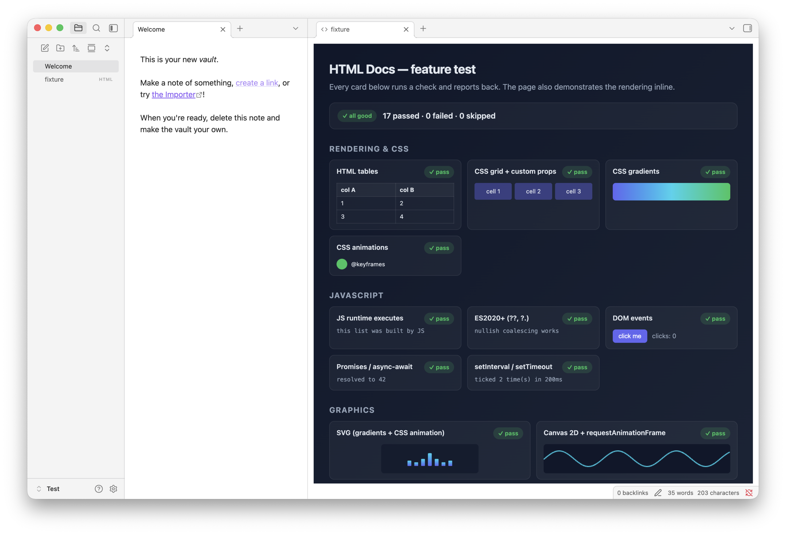

# HTML Docs

A minimal Obsidian plugin to bring the [unreasonable effectiveness of HTML](https://x.com/trq212/status/2052809885763747935) to Obsidian.

* The HTML is rendered in a sandboxed `<iframe>`.
* JS can run inside the HTML for interactivity, but the iframe is isolated from Obsidian and your vault.
* Nothing else. The plugin is ~75 lines of code, ~100 lines of config, and ~520 lines of test.

Fork and extend if you want other features.

## Demo

This plug lets you write your docs as .md or .html and open both inside Obsidian



## Install (manual)

1. Copy the `dist/html-docs/` folder into your vault at `<vault>/.obsidian/plugins/` (so the plugin lives at `<vault>/.obsidian/plugins/html-docs/`).
2. Enable **HTML Docs** in Obsidian's Community Plugins settings.
3. Turn on **Settings → Files & Links → Detect all file extensions** so `.html` files appear in the file explorer. The plugin shows a one-time notice on load if it isn't already on.

To build from source instead: `npm install && npm run build` rebuilds `dist/html-docs/`.

## What works

Anything an isolated page can do without server-side help: HTML, CSS (gradients, grid, animations, custom properties), JavaScript (ES2020+, Promises, `setInterval`, DOM events), inline SVG, Canvas 2D, forms, and absolute HTTPS resources (images, fetch with CORS).

See demo: [test/fixture.html](test/fixture.html)

## What doesn't work (by design)

This plugin intentionally omits `allow-same-origin`, so each HTML page gets an opaque origin — the browser treats it as isolated content. JS still runs, but it can't reach your vault, your notes, or Obsidian's own data.

Which blocks:

- `localStorage`, `sessionStorage`, `IndexedDB`, `document.cookie`
- Reading the parent (`window.parent.*`) — `postMessage` still works
- Vault-relative URLs like `` — use absolute HTTPS or data URLs
- Service workers, geolocation, clipboard, notifications


## Dev

```bash
npm install
npm run dev      # watch + rebuild
npm run build    # production bundle
```

Open any `.html` or `.htm` file in your vault — Obsidian will route it through the plugin's view.

## Test

A smoke-test suite drives a running Obsidian instance via `obsidian-cli`.

```bash
npm test
```

Requires Obsidian running with a vault open, the plugin installed and enabled, and `jq` available. The script copies `test/fixture.html` into the vault temporarily, opens it, verifies the iframe shape from outside Obsidian and collects the iframe's own self-test results via `postMessage`, then cleans up.

See `test/fixture.html` for the full list of features exercised — and the inline notes for what is intentionally blocked.

## The original prompt

```markdown
Research obsidian plugin best practices. Then write a minimalist obsidian plugin which lets me view html files similar to md files inside obsidian.
They will be single html files but they need to be able to run JavaScript.

I want to avoid complexity and aim for a simple and reliable.

Include a test html page which contains all the components we expect to work (include svg).
At the bottom include any components that are known to **not** work.
Include a test runner in the repo to exercise and validate so we have clear expectations of what should work and small automated test suite.
```
